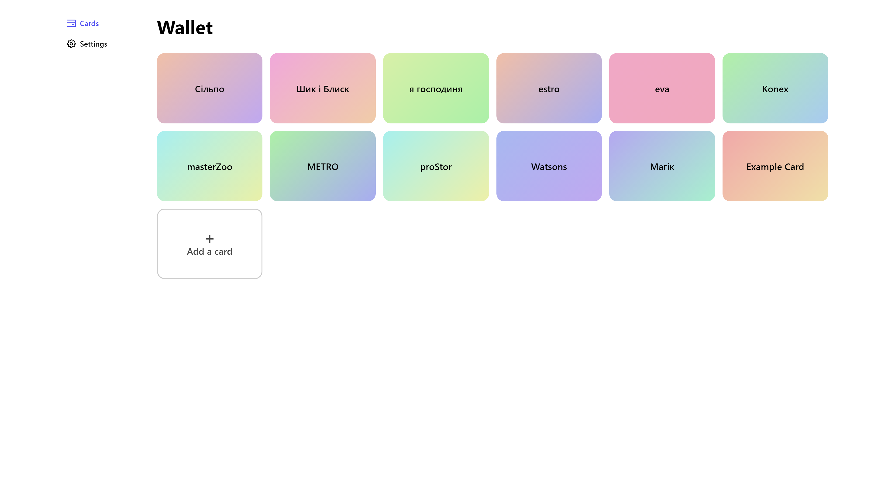
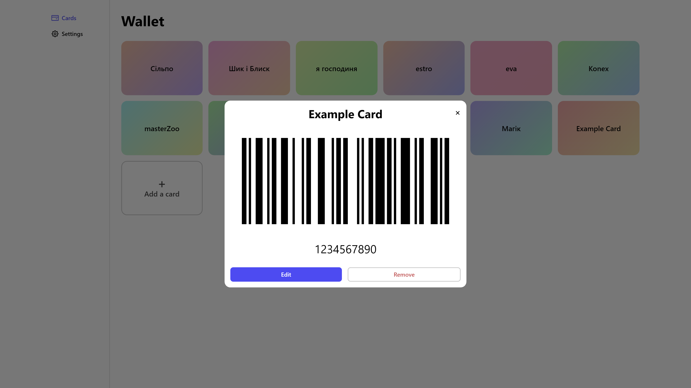

# Loyalty Cards Wallet

One place for all of your loyalty cards.

## Features

- Works offline
- Each card's background is a randomly generated pastel gradient
- Supports both light and dark mode

## Screenshots






More screenshots can be found [here](screenshots/)

## Credits

- Icons: [Octicons](https://primer.style/octicons)

## Development

### Requirements

- Node.js and npm

### Setup

1. Clone the repository

```bash
git clone https://github.com/ivteplo/loyalty-cards-wallet
```

2. Navigate to the folder

```bash
cd loyalty-cards-wallet
```

3. Install dependencies

```bash
npm install
# if you prefer yarn:
yarn install
```

4. Start the development server

```bash
npm run dev
```

5. Happy hacking! 🎉
